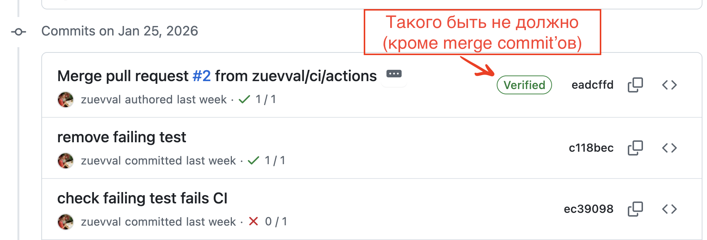

# mtd_l1
modern technologies in development, Lab1

---

## 1. SSH-ключ

1. Сгенерируйте SSH-ключ алгоритмом Ed25519.
Как это сделать, можно прочесть в статье [Generating a new SSH key and adding it to the ssh-agent](https://docs.github.com/en/authentication/connecting-to-github-with-ssh/generating-a-new-ssh-key-and-adding-it-to-the-ssh-agent).
1. Добавьте ключ в аккаунт GitHub (см. [Adding a new SSH key to your GitHub account](https://docs.github.com/en/authentication/connecting-to-github-with-ssh/adding-a-new-ssh-key-to-your-github-account) и [Testing your SSH connection](https://docs.github.com/en/authentication/connecting-to-github-with-ssh/testing-your-ssh-connection)). Сделайте клон этого репозитория на своём компьютере, используя SSH
1. Создайте новую ветку, назвав её, например, `develop`
1. Публичный ключ положите в папку `ssh_keys`.
Имя файла должно быть `id_ed25519.pub`
1. Сгенерируйте отпечаток (fingerprint) ключа и скопируйте в файл `id_ed25519_fingerprint.txt`
1. сделайте commit и push в новую ветку

## 2. Добавление кода

1. Создайте в ветке `develop` в папке `src` подпапки `lab1`, `lab2`, ..., `lab6`, куда положите код лабораторных прошлого семестра (можно просто файлы `lab<x>.c`, если в лабораторной всего один файл кода).
Не следует помещать бинарные и конфигурационные файлы проектов.
1. Создайте файл `src/CMakeLists.txt`, где задайте как минимум 2 компилируемых target'а: один должен собирать бинарник шестой лабораторной, второй - бинарный файл, соответствующий коду в `task3.c`.
По желанию также можно создать таргеты для других лабораторных
1. сделайте commit и push

## 3. Ветвление

В этом задании работаем с файлом `src/task3.c`

1. Сделайте ветку `refactor/rename_b` из ветки `develop` и в ней переименуйте переменную `b`, дав ей любое другое имя. Откройте Pull Request в ветку `develop`, но не вливайте изменения
1. Сделайте другую ветку из ветки `develop` (`refactor/a_type`), где измените тип переменной `a` с `int` на `unsigned int`. Также откройте Pull Request и влейте `refactor/a_type` в `develop`
1. Влейте ветку `develop` в ветку `refactor/rename_b`, не открывая Pull Request (просто у себя, скажем, через терминал), сделайте push
1. Влейте оставшийся Pull Request в `develop`

---
После выполнения всех заданий влейте `develop` в `main` через Pull Request или без него (как удобнее).
Убедитесь, что CI успешно проходит (это означает, что первое задание выполнено верно).

---

**Пример.**
Мой публичный ключ имеет такой вид:

```
ssh-ed25519 AAAAC3NzaC1lZDI1NTE5AAAAIEaX+xKPVYv5ka587F2xLANMS9sELUIfKfSQJXY2X6eJ valera.zuev.zva@gmail.com
```

А вот его отпечаток:
```
SHA256:sN4RMshg5kpAQOWBUrvBVxtruF64cNstVe27R2Esy08
```

**Указание**

Для операций с Git можно выбрать любые графические элементы или консоль, но нельзя интерфейс GitHub.
Если commit'ы будут иметь значок `verified` (которого commit'ы, не сделанные через UI GitHub, лишены, если это не настроить специально), то надо будет переделать.



Рекомендуется делать через консоль.
По крайней мере, нужно знать синтаксис консольных команд, которые это делают.
